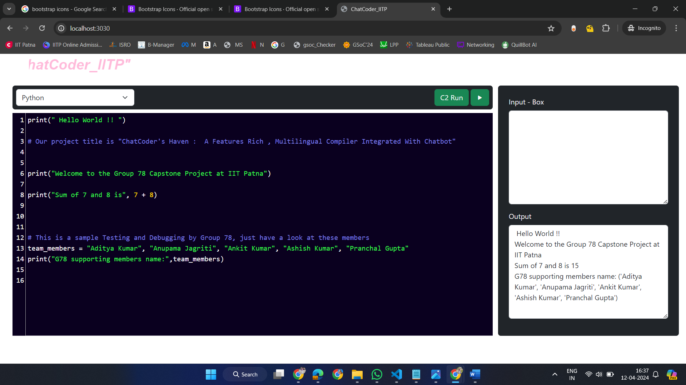

<h1 align="center">ChatCoder's Haven</h1>
<h3 align="center">A Feature-Rich, Multilingual Compiler With Integrated Chatbot</h3>

  

Group 78 : Capstone Project at I.I.T Patna

## About Me
I am a Computer Science and Data Analytics student at IIT Patna. Passionate about web development, I constantly strive to create complex and innovative solutions. As a full-stack web developer, I love learning and exploring new technologies.

<!-- our LINK - TREE handles -->
## Connect with Me

Find me on [Linktree](https://linktr.ee/ankit127iitp) to explore all my social profiles handles and other platforms!

  

<!-- summary of proj -->
## Project Overview

"CHATCODER’S HAVEN” aims to develop a feature-rich web application for online coding, providing users with a multilingual compiler supporting Python, Java, and C++. The platform offers an intuitive coding environment with syntax highlighting tailored to each programming language, along with auto-closing brackets for tags and line numbering displayed on the left side of each line. Users can also enjoy a dark theme option for enhanced visibility and reduced eye strain.

An integrated Chatbot enhances user experience by providing real-time support. Leveraging the MERN stack, the project prioritizes flexibility and scalability for future expansion and integration of new features. While the current iteration offers Python, Java, and C++ programming languages, the project envisions future expansion to incorporate additional languages and functionalities akin to Visual Studio Code (VS Code in Online).

By providing a user-friendly interface, syntax highlighting tailored to each language, and real-time collaboration, we empower coders worldwide. Our project bridges the gap between coding proficiency and accessibility, fostering a vibrant community of learners and creators.

This project is developed and maintained by Group 78 members of Capstone Project 108 at I.I.T Patna.

<!-- GitHub  Repo src -->
## Project Repository
Explore the project repository: [Chat Coder's Haven Repository](https://github.com/ankit485803/ChatCoder-s-Haven_IITP )

<!-- Tech Stack -->
## Tech Stack
- **MERN Stack:**
  - MongoDB
  - Express.js
  - React
  - Node.js
- **Python Programming Language**

<!-- Key Features -->
## Key Features (in short):
- **Multilingual Support:** Code in various programming languages (currently Python, Java, and C++)
- **Real-time Code Compilation and Execution:** Code, compile, and run code snippets within the platform
- **Integrated Chatbot:** Developed a chatbot to assist users with coding tasks on the platform
- **QR Code Sign-in (Upcoming Feature):** Implementing a sign-in feature using QR codes, allowing users to directly login to our portal by scanning and connecting
- **Syntax Highlighting:** Code editor with syntax highlighting tailored to each supported language
- **Auto-closing Brackets and Line Numbering:** Enhanced code readability with automatic bracket closing and line numbering
- **Dark Theme Option:** Improve user experience with a dark theme option for reduced eye strain

<!-- screenshot of testing part -->

<!-- Team member's work DIVISION -->
## Team Members: Roles and Responsibilities

### Frontend Development:

- **Aditya Kumar:**
  - Responsible for creating the Home page
  - In the bustling corridors of our coding haven, Aditya dons the mantle of the Home page creator using HTML, CSS, JavaScript
  - Spearheaded the creation of the project's Home page, ensuring a "user-friendly and welcoming first impression"
  - Owned the design of the Home page, ensuring it effectively communicated ChatCoder's Haven's functionalities

- **Anupama Jagriti:**
  - In charge of the "About Us" page
  - Skillfully wove the narrative for the 'About Us' page using HTML and CSS
  - Mission Statements: Jagriti distills purpose into sentences. "We code, we dream, we iterate."

- **Pranchal Gupta:**
  - Handling the "Contact Us" page
  - Architected user engagement through the 'Contact Us' page, utilizing HTML, CSS, and JavaScript to establish a clear and functional communication channel
  - "Pranchal built the bridge between users and the team by crafting a user-friendly 'Contact Us' through this page" and form fields bridge continents, inviting messages from distant lands.

### Backend & Databases:

- **Ankit Kumar:**
  - Plays crucial and pivotal roles, including:
    - Developing the web application, which serves as an online coding platform with multilingual features
    - Ensuring that the coding environment supports syntax highlighting tailored to each programming language
    - Implementing auto-closing brackets for tags and displaying line numbering on the left side of each line
    - Handling real-time CRUD operations (Create, Read, Update, Delete)
    - Contributing to Testing and Debugging part of code, ensuring a robust application, check and review code of each member before pull (PR) to GitHub
    - Integrating the chatbot into our application but created and developed by Ashish Kumar
    - Reviewing and correcting code errors with the support of all members
    - Merging pull requests, reviewing code, and maintaining the GitHub repository.

- **Ashish Kumar:**
  - Visionary developer, spearheading his development skills to ChatCoder’s Haven project
  - Pioneering user experience by developing a chatbot that will provide real-time coding assistance directly within the platform
  - Streamlining user access by implementing a secure and convenient QR code sign-in feature for ChatCoder's Haven (Upcoming Feature)

Connect with me:

  
  
  
  
  
  <!-- Add more social icons as needed -->

